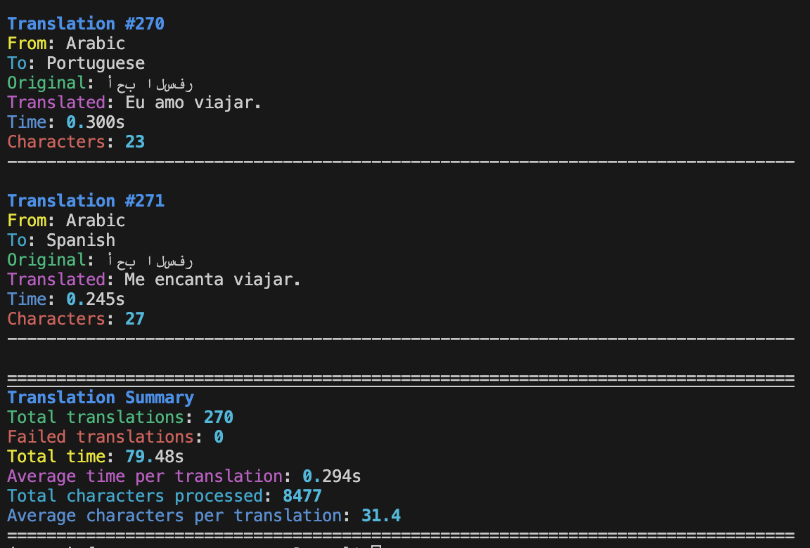

# OCI Translator

## Introduction

The OCI Translator demonstrates the power of leveraging [Oracle Cloud Infrastructure's Generative AI services](https://www.oracle.com/artificial-intelligence/generative-ai/generative-ai-service/) for building practical language translation applications. This project showcases how enterprise-grade AI capabilities can be integrated into a modern web application while maintaining high performance and reliability.

### Why OCI Generative AI?

Oracle Cloud Infrastructure (OCI) Generative AI offers several compelling advantages for translation services:

- **Enterprise-Ready**: Built on OCI's robust infrastructure, ensuring high availability and scalability
- **Cost-Effective**: Pay-as-you-go pricing model with competitive rates for API calls
- **Security-First**: Enterprise-grade security with built-in governance and compliance features
- **High Performance**: Low-latency responses suitable for real-time translation needs
- **Multilingual Support**: Comprehensive support for major world languages with high accuracy
- **Context Awareness**: Advanced language models that understand context and nuances
- **Integration Friendly**: Easy integration with existing cloud infrastructure and applications

This project serves as a practical example of building a translation service that can handle multiple languages while maintaining high quality translations. It includes a comprehensive test script to ensure reliability across different language pairs.

## Features

- RESTful API for text translation
- Powered by OCI's Generative AI model
- Error handling with descriptive messages
- Supports the following languages:

  - Arabic (ar)
  - Chinese (zh)
  - English (en)
  - French (fr)
  - German (de)
  - Italian (it)
  - Japanese (ja)
  - Korean (ko)
  - Portuguese (pt)
  - Spanish (es)

## Project Structure

```
.
├── main.py           # Main application file
├── test.py          # Test suite
├── .env             # Environment variables (create this)
└── requirements.txt  # Project dependencies
```

## Prerequisites

- Python 3.9+
- OCI Account with Generative AI access
- Required environment variables:
  - `OCI_MODEL_ID`
  - `OCI_SERVICE_ENDPOINT`
  - `OCI_COMPARTMENT_ID`

## Installation

1. Clone the repository:

```bash
git clone https://github.com/enricopesce/OCITranslator
cd OCITranslator
```

2. Install dependencies:

```bash
pip install -r requirements.txt
```

3. Create a `.env` file in the project root with your OCI credentials:

```env
OCI_MODEL_ID=your_model_id
OCI_SERVICE_ENDPOINT=your_service_endpoint
OCI_COMPARTMENT_ID=your_compartment_id
```

.env.example file is provided

## Usage

### Starting the Server

Run the application using:

```bash
python main.py
```

The server will start on `http://0.0.0.0:8000` with auto-reload enabled.

## API Documentation

Once the server is running, you can access:

- Interactive API docs: `http://localhost:8000/docs`
- Alternative API docs: `http://localhost:8000/redoc`

### API Endpoints

#### POST /translate

Translates text to the specified target language.

**Request Body:**

```json
{
  "text": "Hello, world!",
  "target_language": "es"
}
```

**Response:**

```json
{
  "translated_text": "¡Hola, mundo!",
  "target_language": "es"
}
```

[Previous sections remain the same...]

### Testing with cURL

You can test the translation service using cURL commands:

```bash
# Basic translation to Spanish
curl -X POST http://localhost:8000/translate \
  -H "Content-Type: application/json" \
  -d '{
    "text": "Hello, how are you?",
    "target_language": "es"
  }'

# Translation to French
curl -X POST http://localhost:8000/translate \
  -H "Content-Type: application/json" \
  -d '{
    "text": "Artificial Intelligence is amazing",
    "target_language": "fr"
  }'

# Translation to Japanese
curl -X POST http://localhost:8000/translate \
  -H "Content-Type: application/json" \
  -d '{
    "text": "I love programming",
    "target_language": "ja"
  }'
```

Example response:

```json
{
  "translated_text": "¡Hola, cómo estás?",
  "target_language": "es"
}
```

## Testing by script

The project includes a comprehensive test script (`test.py`) that validates translations across multiple languages with detailed reporting.

### Running Tests

Basic usage:

```bash
python test.py
```

Available options:

- `--list-languages`: Display all supported languages
- `--source-languages`: Specify source languages to test (e.g., "Spanish French")
- `--base-url`: Set custom service URL (default: http://localhost:8000)

Example commands:

```bash
# List all available languages
python test.py --list-languages

# Test specific languages
python test.py --source-languages Spanish French

# Test with custom server
python test.py --base-url http://your-server:8000
```

An output example:




## Contributing

1. Fork the repository
2. Create a feature branch
3. Commit your changes
4. Push to the branch
5. Create a Pull Request
